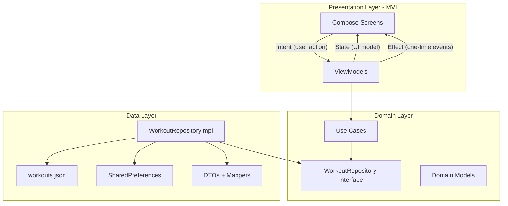
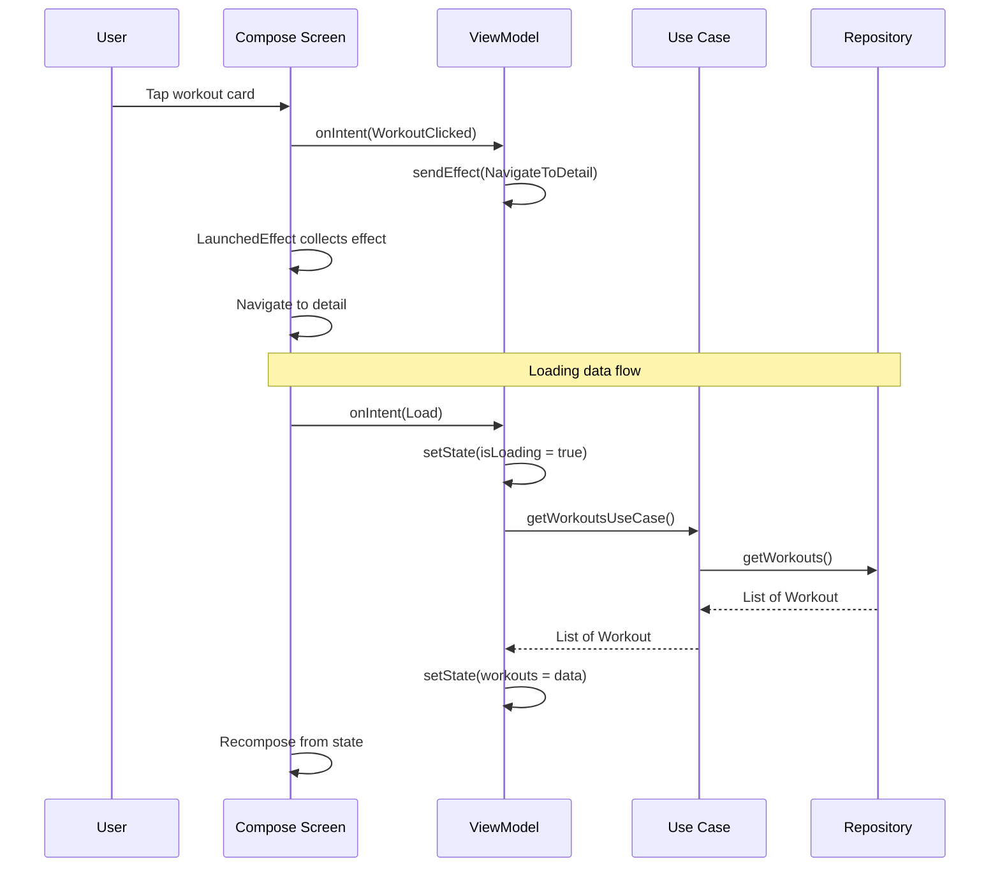
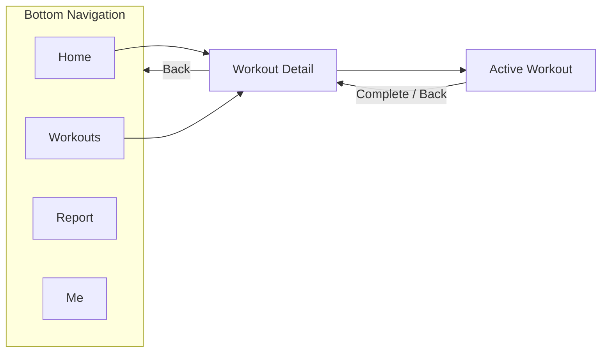
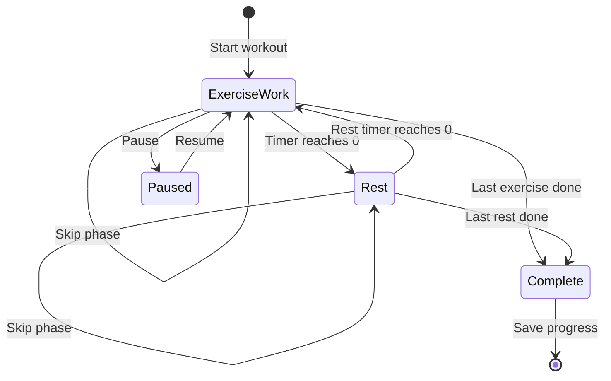

# Home Workout

An Android fitness app inspired by [Home Workout - No Equipment](https://play.google.com/store/apps/details?id=homeworkout.homeworkouts.noequipment). Built with **Jetpack Compose**, **Clean Architecture**, and the **MVI** pattern. All workout content is loaded from local JSON — no backend required.

---

## Features

- **Home dashboard** — featured workout, streak stats, category filters, popular workouts
- **Workout catalog** — filter by body part (Abs, Chest, Legs, etc.) and difficulty
- **Workout detail** — duration, calories, exercise list with instructions
- **Active workout session** — countdown timer, work/rest phases, pause, skip, finish
- **Progress report** — total workouts, minutes, calories, streak, history
- **Profile** — stats summary and settings placeholders
- **Offline-first** — workouts from `assets/workouts.json`, progress in SharedPreferences

---

## Tech Stack

| Category | Libraries |
|----------|-----------|
| UI | Jetpack Compose, Material 3 |
| Architecture | Clean Architecture + MVI |
| Navigation | Navigation Compose |
| Async | Kotlin Coroutines, StateFlow |
| JSON | Kotlinx Serialization |
| DI | Manual (`AppContainer`) |
| Min SDK | 24 (Android 7.0) |
| Target SDK | 36 |

---

## Architecture Overview

The app follows **Clean Architecture** with three layers. Dependencies point inward: Presentation → Domain ← Data.



### Layer responsibilities

| Layer | Package | Responsibility |
|-------|---------|----------------|
| **Presentation** | `presentation/` | UI, MVI contracts, ViewModels, navigation |
| **Domain** | `domain/` | Business models, repository interface, use cases |
| **Data** | `data/` | JSON loading, DTO mapping, repository implementation |
| **DI** | `di/` | `AppContainer`, ViewModel factory |

---

## MVI Workflow

Each screen uses **Model-View-Intent (MVI)**:

| Piece | Purpose | Example |
|-------|---------|---------|
| **Intent** | User or system action | `HomeIntent.WorkoutClicked(id)` |
| **State** | Single source of truth for UI | `HomeState(isLoading, workouts, …)` |
| **Effect** | One-time side effects | `NavigateToWorkoutDetail` |



### Base MVI classes

```
presentation/mvi/
├── MviContract.kt    → MviIntent, MviState, MviEffect markers
└── MviViewModel.kt   → state (StateFlow), effect (Channel), setState(), sendEffect()
```

### Per-feature MVI structure

Every feature follows the same pattern:

```
presentation/home/
├── HomeContract.kt   → HomeIntent, HomeState, HomeEffect
├── HomeViewModel.kt  → extends MviViewModel
└── HomeScreen.kt     → collects state + effects
```

Same pattern for: `workouts`, `workoutdetail`, `activeworkout`, `report`, `profile`.

---

## App Navigation Flow



| Route | Screen | ViewModel |
|-------|--------|-----------|
| `home` | HomeScreen | HomeViewModel |
| `workouts` | WorkoutsScreen | WorkoutsViewModel |
| `report` | ReportScreen | ReportViewModel |
| `profile` | ProfileScreen | ProfileViewModel |
| `workout_detail/{id}` | WorkoutDetailScreen | WorkoutDetailViewModel |
| `active_workout/{id}` | ActiveWorkoutScreen | ActiveWorkoutViewModel |

---

## Active Workout Flow



ViewModel intents: `Load`, `Tick`, `TogglePause`, `SkipPhase`, `FinishWorkout`.

---

## Project Structure

```
app/src/main/
├── assets/
│   └── workouts.json                 # Local workout catalog
├── java/com/example/homeworkout/
│   ├── MainActivity.kt
│   ├── di/
│   │   ├── AppContainer.kt           # Dependency wiring
│   │   └── ViewModelFactory.kt
│   ├── domain/
│   │   ├── model/WorkoutModels.kt
│   │   ├── repository/WorkoutRepository.kt
│   │   └── usecase/WorkoutUseCases.kt
│   ├── data/
│   │   ├── local/
│   │   │   ├── WorkoutAssetDataSource.kt
│   │   │   ├── ProgressLocalDataSource.kt
│   │   │   └── dto/WorkoutDtos.kt
│   │   ├── mapper/WorkoutMapper.kt
│   │   └── repository/WorkoutRepositoryImpl.kt
│   ├── presentation/
│   │   ├── mvi/
│   │   ├── home/
│   │   ├── workouts/
│   │   ├── workoutdetail/
│   │   ├── activeworkout/
│   │   ├── report/
│   │   ├── profile/
│   │   ├── navigation/
│   │   └── components/
│   └── ui/theme/
```

---

## Data Model

### Workout catalog (`workouts.json`)

10 bundled workouts across categories:

| Category | Example workouts |
|----------|------------------|
| Full Body | 7 Min Full Body, Total Body Advanced |
| Abs | Extreme Ab Workout |
| Chest | Chest Power |
| Legs | Leg Day Burn |
| Arms | Arm Sculpt |
| Butt | Booty Lift |
| HIIT | HIIT Fat Burn |
| Warm Up | Dynamic Warm Up |
| Stretch | Cool Down Stretch |

Each workout contains exercises with:
- `durationSeconds` / `restSeconds`
- `instructions`
- `muscleGroup`
- `caloriesPerMinute`

### Progress storage

Completed workouts are saved via `ProgressLocalDataSource` (SharedPreferences):
- Total workouts, minutes, calories
- Current streak and best streak
- Last 30 workout history entries

---

## Use Cases

| Use Case | Description |
|----------|-------------|
| `GetWorkoutsUseCase` | Load all workouts |
| `GetWorkoutByIdUseCase` | Load single workout |
| `GetFeaturedWorkoutUseCase` | Load featured workout for home |
| `GetWorkoutsByCategoryUseCase` | Filter by category |
| `GetUserProgressUseCase` | Load user stats |
| `SaveWorkoutCompletionUseCase` | Persist completed workout |

---

## Getting Started

### Prerequisites

- Android Studio (Ladybug or newer recommended)
- JDK 11+
- Android SDK 36

### Run the app

1. Clone the repository
   ```bash
   git clone <your-repo-url>
   cd HomeWorkout
   ```

2. Open the project in Android Studio

3. Sync Gradle and run on an emulator or device (API 24+)
   ```bash
   ./gradlew assembleDebug
   ```

---

## Adding a New Workout

Edit `app/src/main/assets/workouts.json`:

```json
{
  "id": "my_custom_workout",
  "name": "My Custom Workout",
  "description": "Short description here.",
  "category": "FULL_BODY",
  "difficulty": "BEGINNER",
  "durationMinutes": 10,
  "calories": 70,
  "accentColor": "#FF6D00",
  "isFeatured": false,
  "exercises": [
    {
      "id": "push_ups",
      "name": "Push Ups",
      "durationSeconds": 30,
      "restSeconds": 15,
      "instructions": "Keep core tight and lower chest to floor.",
      "muscleGroup": "CHEST"
    }
  ]
}
```

**Valid enum values:**
- `category`: `FULL_BODY`, `ABS`, `CHEST`, `LEGS`, `ARMS`, `BUTT`, `HIIT`, `WARM_UP`, `STRETCH`
- `difficulty`: `BEGINNER`, `INTERMEDIATE`, `ADVANCED`
- `muscleGroup`: `FULL_BODY`, `ABS`, `CHEST`, `LEGS`, `ARMS`, `BUTT`, `BACK`, `SHOULDERS`

---

## Adding a New Screen (MVI checklist)

1. Create `FeatureContract.kt` — define `Intent`, `State`, `Effect`
2. Create `FeatureViewModel.kt` — extend `MviViewModel`
3. Create `FeatureScreen.kt` — collect `state`, handle `effect`
4. Register ViewModel in `AppViewModelFactory`
5. Add route in `HomeWorkoutNavHost.kt`

---

## Future Improvements

- [ ] Hilt dependency injection
- [ ] Room database for history
- [ ] Lottie / video exercise animations
- [ ] Onboarding flow (goals, fitness level)
- [ ] Workout reminders (AlarmManager / WorkManager)
- [ ] Unit tests for ViewModels and use cases

---

## Disclaimer

This project is an educational clone inspired by publicly available fitness app UX patterns. It is not affiliated with Leap Fitness Group or the original Home Workout app.

---

## License

MIT License — add a `LICENSE` file if you plan to open-source this project.
